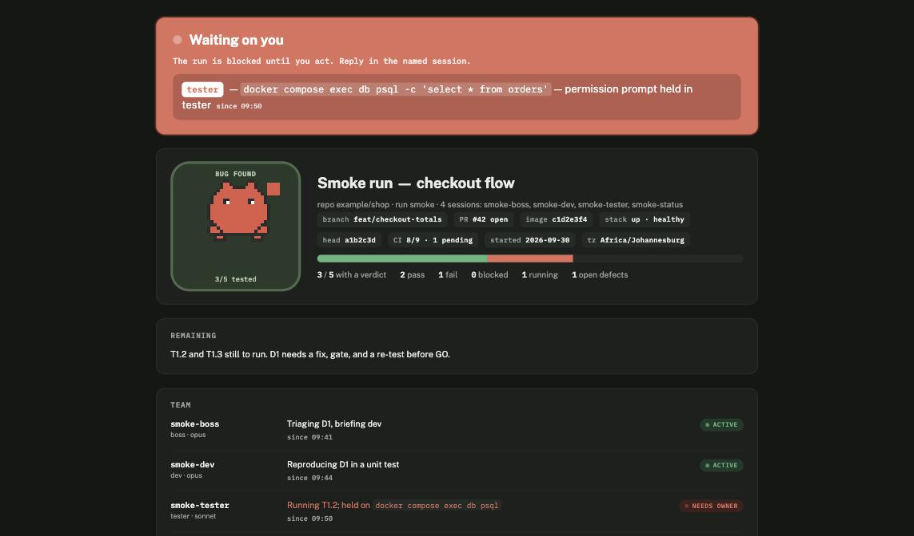
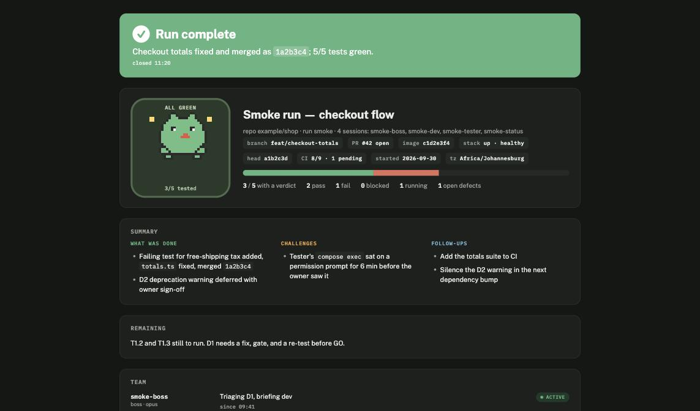
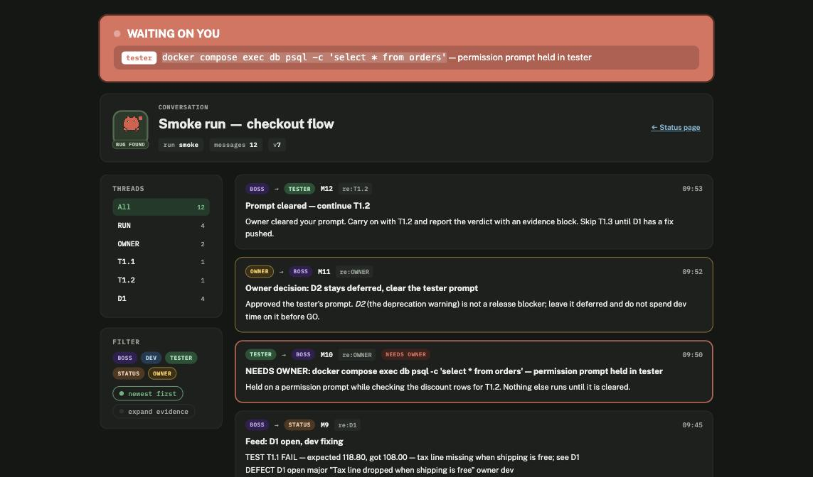
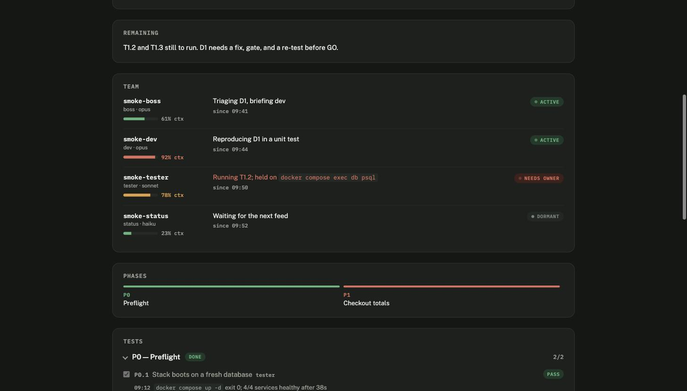

# boss

**Run a piece of work as a small team of Claude Code sessions, and follow it from a live page.**

You open four terminals. One is the *boss*: it plans the work, proposes a team, briefs the others,
reviews every change, and decides when it's done. A *dev* fixes things. A *tester* runs things and
collects evidence. A *status* session publishes two pages you can open on your phone: a status
tracker and a threaded log of everything the sessions said to each other.

You stay the owner. The team stops and asks whenever it needs your decision, and the page tells you
so in a banner you cannot miss.

<p align="center">
  
</p>

## Why

Letting one Claude session do everything means it edits, tests and judges its own work in one
context window, and you only see what it chooses to tell you. Splitting the work across sessions with
strict roles gives you:

- **Separation of hands.** The session that edits code never touches the test stack; the session that
  runs tests never edits code; the one that decides never does either.
- **Evidence you can check.** Every verdict comes with the command, its exit code and its output.
- **A record.** Every message between sessions is numbered and kept, and rendered as a conversation
  page with threads per test and per defect.
- **No silent stalls.** A session held on a permission prompt tells the boss immediately, and the
  boss puts it on the first line to you. The page shows a banner until you act.
- **No silent forgetting.** Each session's context is on the page; a full one compacts itself and
  re-orients from the run directory instead of losing the plot.
- **No babysitting.** Set the team up once; runs chain milestones and roll into the next `/boss` in
  the same terminals. Overnight runs need nobody at the keyboard.

## Install

Requirements: Claude Code CLI 2.1 or later, macOS or Linux, `python3` (3.10+), `bash`, `git`.
Enough screen for four terminals.

```bash
git clone https://github.com/lukevenediger/boss-skill ~/boss-skill
bash ~/boss-skill/install.sh
```

`install.sh` symlinks each skill under `skills/` into `~/.claude/skills`, so the clone is the source
of truth and `git pull` updates it in place. Start a new Claude Code session; `/boss` now appears in
the skill list.

To remove: `bash ~/boss-skill/install.sh --uninstall`.

> Do not also install this repo as a Claude Code plugin. Both installs would trigger at once.

## Use it

### 1. Start the boss

In the repo you want worked on:

```
claude
/rename myrun-boss
/boss fix the CSV splitter so `split.sh a,b,c` keeps the last field, and prove it with the gate
```

Say what "done" looks like in one sentence. The boss drafts a short phased plan (you'll see it in
plan mode) and then shows a **team proposal**: a table of roles, one model per role, who owns the
shared infrastructure, and which permission mode every terminal must use. Reply:

```
approve team
```

(or say what to change: drop the tester for a docs-only run, add a reviewer, use a different model).

### 2. Open the other terminals

The boss prints a block like this:

```
Open these terminals, in the same permission mode as this one (auto):

Terminal 2 (dev):     cd /path/to/repo && claude --model opus     then  /rename myrun-dev     then  /boss-dev myrun
Terminal 3 (tester):  cd /path/to/repo && claude --model sonnet   then  /rename myrun-tester  then  /boss-tester myrun
Terminal 4 (status):  cd /path/to/repo && claude --model opus     then  /rename myrun-status  then  /boss-status myrun

Say "team up" here when all three prompts are idle.
```

Open them exactly as printed. Each session announces itself to the boss. When all three prompts are
idle, tell the boss:

```
team up
```

### 3. Follow along

The boss's next message gives you two links: the **status page** and the **conversation page**. Open
them anywhere. From here the team runs on its own: the boss briefs, the tester reports verdicts with
evidence, defects get numbered, the dev fixes them test-first, the boss reviews each change and sends
the tester back to re-verify, and the pages update after every step.

Watch for two things:

- **"Waiting on you"** at the top of either page. The run is blocked until you answer in the named
  terminal, whether that's a permission prompt, an approval, or a GO / NO-GO decision.
- **Defects** moving `open → fixing → fix-pushed → verified` on the board.

### 4. Let it run

After `team up` the team does not need you. Milestones roll into the next one on their own, GO / NO-GO
is recorded as a recommendation, minor defects are deferred and listed for your review, and sessions
that fill their context compact themselves and carry on. It stops only for a blocker nobody can route
around or a permission prompt (and for overnight runs there is a flag that turns prompts into
refusals the team routes around — see *Running unattended*).

### 5. Wrap up

When the map is exhausted the boss writes the outcome, lists everything deferred for your review,
and closes the run with a summary. The status page ends like this:

<p align="center">
  
</p>

Everything a run produced stays under `~/.boss/runs/<run-id>/`: the plan, the full conversation
log, every piece of evidence, the pages. **Leave the terminals open** — see *Reusing the sessions*.
When you no longer need old runs:

```
bash ~/boss-skill/skills/boss-protocol/scripts/boss-run list              # what's there
bash ~/boss-skill/skills/boss-protocol/scripts/boss-run clean --dry-run   # what would go
bash ~/boss-skill/skills/boss-protocol/scripts/boss-run clean -y          # remove every closed run
bash ~/boss-skill/skills/boss-protocol/scripts/boss-run clean -y --older-than 14
```

Open runs are never removed without `--force`.

### 6. Start the next run in the same terminals

```
/boss <next goal>
```

That's the whole step. See *Reusing the sessions* for what happens.

## The conversation page

Every message between sessions is numbered (`M1`, `M2`, …), threaded by what it's about (a test id,
a defect id, or the run itself), and rendered newest-first with markdown, collapsible evidence, and a
gold badge for your own decisions.

<p align="center">
  
</p>

## Use cases

**A test campaign before a merge.** "Test the new ingestion feature end to end on the local stack
using the real supplier files in `./samples`, fix what breaks, and tell me if it's safe to merge."
The boss writes a phased plan (preflight, happy path, edge cases, idempotency, permissions, reconciliation),
the tester works through it with evidence, the dev fixes defects test-first, and you get a GO / NO-GO
with the reasoning on one page. This is the run the skill was built from: 34 tests, 8 defects, all
verified, one afternoon.

**A bug-fix loop with independent verification.** "Users report `/export` returns 500 for accounts
with no orders. Reproduce, fix, and prove it." The tester reproduces and files D1 with the exact
request and response; the dev writes the failing test, fixes it, pushes; the boss reviews the diff;
the tester re-runs the original repro against the rebuilt service. Nobody grades their own homework.

**A release gate or migration rehearsal.** "Rehearse the database migration on a copy of last night's
snapshot: time each step, confirm the app comes up, and list anything that would need a maintenance
window." Add a `perf` or `dba` role through the proposal; the boss writes it a charter and it reports
like any other session.

**Building from a large spec.** `/boss plan docs/REQUIREMENTS.md — build this` on a 2000-line
document does not produce a 2000-line plan. The boss reads the spec, writes a *milestone map* (M1…Mn,
one line each, about a day of work apiece), asks which milestone to run, and plans only that one as
work items (`W1.1 dev: …`, citing the spec section) with tests to prove them. One run per milestone;
the next run picks up from the map.

**Anything where you want a paper trail.** The conversation log is the audit: who ran what, what it
returned, who decided what, and when.

## The roles

| Role | Owns | Never |
|---|---|---|
| **boss** | the plan, briefs, read-only review of every change, triage, go/no-go, the status feed | edits the repo, runs git writes, touches the stack |
| **dev** | the checkout and branch: failing test → fix → gate → commit → push | the shared stack, force-push |
| **tester** | the shared stack; running exactly what the brief says; evidence; defect reports | editing or committing anything |
| **status** | the two published pages | anything else; inventing a verdict |
| **extra roles** | whatever the boss's charter says (`/boss-role <name> <run-id>`) | whatever it forbids |

Models are proposed per run. Status always runs on the latest Opus. The boss runs on whatever model
your session uses.

## Things to know

- **Same permission mode everywhere.** If one terminal runs in a different mode, messages between
  sessions get held for approval and the run stalls silently. The boss prints the mode; match it.
- **Session names matter.** `/rename <run-id>-<role>` is how the sessions find each other.
- **Several teams at once is fine.** Each role registers its session with its run at start, so two
  bosses on one machine never cross wires; always start a role with the run id the boss printed.
- **Runtime lives in `~/.boss/`**, never in your repo. Delete a run directory when you're done with it.
- **The boss asks twice, then runs.** `approve team` and `team up` at the start; after that it stops
  only for a blocker or a held permission prompt, and the page shows a banner each time.
- **Compaction is automatic.** The amber banner is information, not a chore. `/compact` by hand only
  if a session stalls after compacting.
- **Pages are private artifacts** on claude.ai. Share them from the page's Share menu if colleagues
  should see them.

## Context windows

Each session's context fills up over a long run. When it does, Claude Code compacts it automatically
and the session re-orients itself from the run directory (`boss-run resume`) and carries on; the
session name and its messages survive. You do not need to do anything. The status page shows a small
context meter on every team row and an amber banner at 90% so you can see it coming; `/compact` by
hand only if a session visibly stalls afterwards.

<p align="center">
  
</p>

Readings come from the session transcripts by default. When the model's window size isn't known that
is an estimate (shown as `≈`, and it never triggers the compact banner). For exact numbers, wire the
shipped wrapper into your status line, keeping whatever command you already have after it:

```json
"statusLine": { "type": "command", "command": "bash ~/boss-skill/skills/boss-protocol/scripts/boss-statusline <your existing command>" }
```

## Reusing the sessions

You set the team up once. After that, every run reuses the same four terminals, and nothing in this
skill ever asks you to close, rename or restart one.

- **Next run:** type `/boss <goal>` in the boss terminal. The boss creates a new run id, sends each
  role `NEW RUN <id>`, and the roles re-run their own start steps for it. New pages, same sessions.
- **Milestones:** inside a run, the boss chains from one milestone to the next by itself (ticks the
  map, appends the next phases, re-briefs). You are not asked in between.
- **Compaction:** when a session's context fills, Claude Code compacts it automatically. The session
  keeps its name, re-orients itself with `boss-run resume`, and carries on from its last brief. The
  page shows a meter and an amber banner so you can see it coming; nothing for you to do.
- **If a session dies anyway** (laptop rebooted, terminal closed): open a terminal in the repo,
  `claude --resume <id>-<role>` (the name resolves the session), and the role picks up from the run
  directory. Or start fresh with the same `/rename` + `/boss-<role> <id>` lines from the terminal block.

## Running unattended

Overnight, or driving it from a phone over a remote connection, you want zero prompts.

1. Answer the team proposal with `approve team, unattended`.
2. The terminal block the boss prints then carries `--permission-prompts none` on every `claude`
   line. Open the terminals with those lines.
3. Say `team up` and leave.

What that changes: a call that would have sat on a permission prompt comes back as a refusal; the
role reports it as `BLOCKED` with the reason, and the boss routes around it (re-plans, re-briefs, or
defers). Everything else is already unattended by default:

| Event | What happens without you |
|---|---|
| Milestone finishes | Next milestone starts; the page shows `milestone M3/11` |
| GO / NO-GO point | Recorded as `recommendation: GO — <why>` in the log; run continues |
| Minor defect | Fixed if cheap, else deferred by the boss and listed under *Remaining* |
| Major / blocker defect | Fixed through the normal loop; a true blocker is the one thing that stops the run, with a banner |
| Session context fills | Compacts itself and resumes |
| Map exhausted | Outcome, summary and *Remaining* on the page; sessions idle |

In the morning, read the page top to bottom: the green or red banner, the summary, then *Remaining*
for the deferrals that are yours to accept or send back.

## Layout

| Path | What |
|---|---|
| `skills/boss/` | orchestrator skill; templates for the team proposal, plan, briefs and role charters |
| `skills/boss-dev/`, `boss-tester/`, `boss-status/`, `boss-role/` | one charter per role |
| `skills/boss-protocol/` | `protocol.md` (the contract every role follows) and the scripts `boss-run`, `boss-say`, `boss-state`, `boss-render` |
| `skills/boss-status/templates/` | the two pages, rendered from JSON |
| `tests/` | script tests, pressure-test transcripts for each charter, a toy repo for a full dry run |

## Try it without risking anything

```bash
bash ~/boss-skill/tests/toy-repo.sh          # builds /tmp/boss-toy with one planted bug
cd /tmp/boss-toy && claude
/rename toy-boss
/boss fix the last-field bug in lib/split.sh and prove it with the gate
```

## Developing the skill

```bash
bash tests/scripts.test.sh                        # 21 golden tests for the scripts
bash skills/boss-status/fixtures/smoke/preview.sh # renders both pages from a fixture into /tmp/boss-preview
```

Charters were written test-first: `tests/scenarios/baseline-*.md` records what fresh sessions did
*without* each charter, `green-*.md` what they did with it. Change a charter the same way.

## License

MIT.
